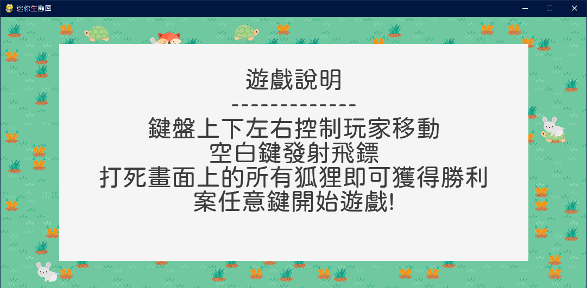
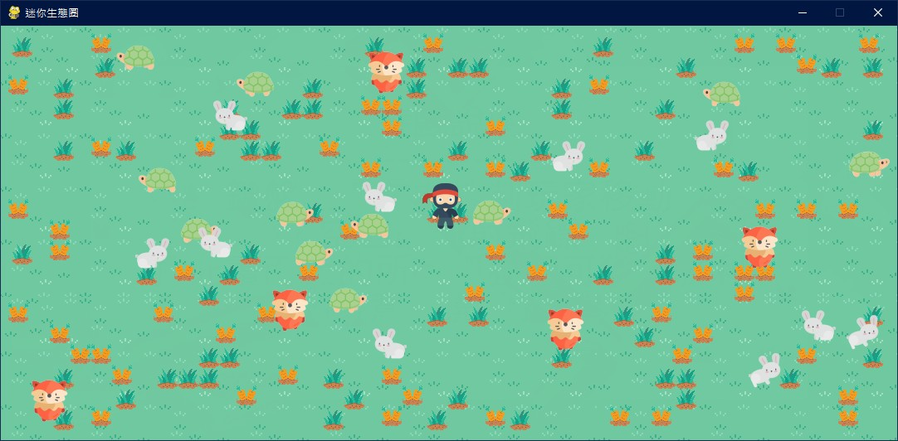

# 🌱 Simulation-of-Life 

模擬一個小型的生態圈的遊戲

## 👩‍🔧 成員

-   ### 程式開發
    -   黃品硯、李德珊、許家菱、王姵淇
-   ### 美工/圖片設計
    -   王姵淇

## 🛠 開發環境

-   Python 3.7.6
-   PyGame 1.9.6

## 💻 執行方法

-   使用 python3 執行 main.py
    ```python
      python3 main.py
    ```

## 📖 遊戲說明



## 🗺 預覽圖


